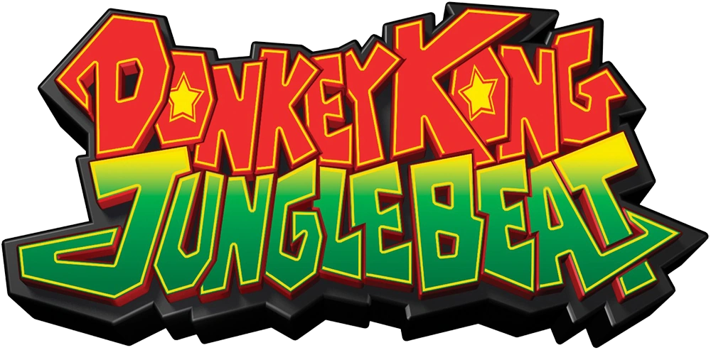

# Jungle Beat Patch



Play the Wii release of **Donkey Kong Jungle Beat** with a **GameCube
controller**, a set of **DK Bongos**, or a **Classic Controller** — instead of
a Wii Remote and Nunchuk. Works with the USA (`R49E01`), European (`R49P01`)
and Japanese (`R49J01`) releases.

The patch is applied to your own copy of the game: drop a clean `.wbfs` or
`.iso` onto the patcher, tick the controllers you want, and play the result on
a Wii (USB loader) or in Dolphin. Nothing from the game is included in this
repository.

## Controllers

The patcher lets you pick either or both:

- **Classic Controller** — Vague Rant and crediar's Gecko codes, applied
  straight to the game's `main.dol`.
- **GameCube controller and DK Bongos** — new in this patch.

**No Wii Remote needed for the GameCube controller or bongos.** With one in
port 1 and no Wii Remote connected, the game is told a Wii Remote with a Nunchuk
is there and plays normally. If a Wii Remote is connected too, it keeps working
next to the pad (the bongos leave its motion alone; a GameCube controller takes
over the Nunchuk and motion). Unplug the pad to go back to the Wii Remote and
Nunchuk. The Classic Controller still needs a Wii Remote to plug into.

### GameCube controller (port 1)

| Input | Action |
| --- | --- |
| Control stick | Move / menu navigation / steer a bubble |
| A | Jump / confirm (Wii Remote A) |
| B, R, Z | Crouch, next page, back (Wii Remote B) |
| L | Crouch, previous page (Nunchuk Z) |
| Y | Clap (a single swing) |
| X | Shake (hold) — for the boss fights, the banana grab, the shake prompt |
| D-pad | D-pad |
| Start | Pause (+) and hint (2) |
| L + R + Start | HOME button |

### DK Bongos (port 1)

The bongos have no sticks, so a drum hit runs DK for a moment, like the
original GameCube game:

| Input | Action |
| --- | --- |
| Right drum | Run right (and menu right) |
| Left drum | Run left (and menu left) |
| Both drums together | Jump / confirm |
| Clap | Clap |
| Start | Pause (+) and hint (2) |

With no Wii Remote, clap to a beat for the "Shake your controllers!" prompt:
each clap swings the opposite way to the last. With a Wii Remote (and Nunchuk, if
you have one) it keeps working next to the bongos, so you can shake it for that
prompt and tilt it to steer the bubble.

### Classic Controller

| Classic Controller | Action |
| --- | --- |
| Left stick | Move / menu navigation / steer a bubble |
| A, B | Jump / confirm |
| R, ZR | Crouch, next page |
| L, ZL | Crouch, previous page |
| Y | Clap |
| X | Shake (hold) |
| D-pad | D-pad |
| + / − | Pause + hint 2 / hint 1 |
| HOME | HOME button |

## Installing

### Patch your disc image

You need a clean `.wbfs` or `.iso` of the **USA** (`R49E01`), **European**
(`R49P01`) or **Japanese** (`R49J01`) release and
[Wiimms ISO Tool](https://wit.wiimm.de/) (`wit`) on your `PATH` (the downloadable
apps bundle it).

```bash
python3 tools/gui.py
```

Tick *Classic Controller* and/or *GameCube controller and DK Bongos*, then drop
the image onto the window (or click to choose it). The patcher checks the disc
ID, patches `sys/main.dol`, rebuilds the image in the same format, and replaces
your file, keeping the original next to it as `<name>.bak`. Other regions, and
images that are already patched, are refused rather than corrupted.

### Play on a Wii

Copy the patched image to your USB loader's drive as usual. In the loader's
settings for this game, turn the **debugger, hook type and cheats off**: the
loader's cheat code handler loads into the same memory as the patch and
black-screens the game.

### Play in Dolphin

Boot the patched image, set GameCube Port 1 to *Standard Controller*, *DK
Bongos* or an adapter. No emulated Wii Remote is needed. (If you drive
the pad from a script or a pipe, turn on *Background Input*.)

### Riivolution (no disc patching)

`Jungle-Beat-Riivolution.zip` from the releases page (or `riivolution/sd/` in
this repo): copy its contents to the root of your SD card. Start the game from
Riivolution, pick your region's patch and choose *GameCube / Bongos + Classic
Controller*, *GameCube controller / DK Bongos* or *Classic Controller*. The
patch writes its code to `0x80001820` from a file in `/JungleBeatPatch` and
branches the game into it, so it behaves like the patched image. Dolphin can
load it too (Riivolution patch window). I haven't been able to try this one on a
console or in Dolphin's Riivolution loader; the bytes are the ones the patcher
puts in the DOL.

### Gecko codes

`codes/<disc id>.ini` (also `Jungle-Beat-Gecko-Codes-Classic-Controller.zip`)
are Vague Rant and crediar's Classic Controller codes, ready for Dolphin's
`GameSettings` folder or a USB loader. There is no Gecko code for the GameCube
controller / DK Bongos: the code is about 3 KB and a Gecko code handler only
has room for roughly 1.8 KB of codes, so Dolphin and the loaders drop it. Use
the patched image or Riivolution for those.

### Command line

```bash
python3 tools/jbpatch.py <retail main.dol> <patched main.dol> [--no-classic] [--no-gamecube]
```

## Known limitations

- The game is single player (it has no multiplayer mode), so only the controller
  in GameCube port 1 is used; ports 2-4 are ignored.
- Without a Wii Remote there is no pointer, so the HOME Menu (L + R + Start on a
  GameCube controller) can't be steered.
- On bongos alone the "Shake your controllers!" prompt takes rhythmic clapping.
- Hot-plugging the GameCube controller is handled, but I've only been able to
  test it in Dolphin. Reports from a real Wii are welcome.

## Building from source

The patcher needs only Python 3 and `wit`. The GameCube half (`src/`) ships
prebuilt in `tools/prebuilt/blobs.json`, checked against its source hash by the
tests. With [devkitPPC](https://devkitpro.org/) installed, `tools/build_blobs.py`
rebuilds it and `tools/make_riivolution.py` regenerates the Riivolution patch. Run the tests with `python3 -m unittest discover -s tests`.

How the patch works is in [docs/TECHNICAL.md](docs/TECHNICAL.md).

## Credits

- **Vague Rant** and **crediar** for the Classic Controller Gecko codes for
  *Donkey Kong Jungle Beat*, which this patch applies unchanged and whose
  approach (a Wii Remote reporting a Nunchuk) the GameCube controller support
  follows.
- Gecko code format and code handler by the Gecko / WiiRD community.
- Patcher layout from [Barrel-Blast-Patch](https://github.com/quatric/Barrel-Blast-Patch).

## Contact

quatricsoftware@gmail.com

No support will be provided for this tool.

## License

MIT — see [LICENSE](LICENSE).

Copyright (c) 2026 quatric
